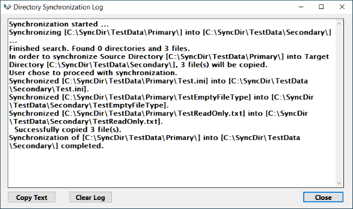

# Directory Synchronization Utility

The Directory Synchronization program, **SyncDirPas**, synchronizes the file contents of directories on a personal computer running Microsoft Window.

This program is free open source software licensed under the [./MIT-License.html](./MIT-License.html "MIT License"), Copyright © 2021 Rick Rutt.

The program compares file names and modification dates for a [source directory](#SourceDirectory) and a [target directory](#TargetDirectory) (and optionally any [subdirectories](#IncludeSubdirectories)).

- If a newer file is found in the source directory, the program replaces the matching file in the target directory. (Optionally, [older source files](#CopyOlderFiles) may also replace newer target files.)

- If a file exists only in the source directory, the program copies the file to the target directory.

- The program will optionally delete any [files](#DeleteExtraFiles) or [directories](#DeleteExtraDirectories) that exist only in the target directory.

- An option allows the synchronization to operate in [both directions](#SynchronizeBothWays) between the two directories.

- Prior to copying or deleting any files, the program prompts the user for [final confirmation](#ConfirmationDialog). Upon completion of any copies or deletions, the program displays a [log window](#LogWindow) that describes all file actions that were performed. (The confirmation dialog and log window do not appear if the **[Automatic](#Automatic)** option is enabled and the **[NotifyUser](#NotifyUser)** option is disabled.)

- An option allows the program to [automatically check](#Automatic) for any file synchronization, or to wait for the user to complete a [synchronization dialog](#SynchronizationDialog). In this **[Automatic](#Automatic)** mode, the program may also [launch another application](#RunCommand) upon completion.

This program may be used for the following purposes:

- **[Program Copy Management](#ProgramCopyManagement)**: Automatically copy updated files from a shared file server directory to a directory on the computer's hard disk. The user's desktop hard disk is treated only as a local cache for the application programs. The file server contains the single centrally managed official copy of the application.

- **[File Backup](#FileBackup)**: Copy revised files from a working directory to a backup directory on another disk or on a file server.

- **[Dual Computer File Coordination](#DualComputerFileCoordination)**: Use an external USB drive (or diskette) as a transport mechanism to move data files, in both directions, between an office computer and a home computer. (_Note_: You cannot target a newly formatted diskette. At least one file or empty directory must be present on the diskette.)

The user may also design variations and combinations of these techniques.

Information about the development history and source code compilation of the **SyncDirPas** program appear at the end of this document in the [Developer Information](#DeveloperInformation) section.

## Synchronization Dialog

The following dialog box appears when the program is started, and the Automatic option is disabled:

The **[Source Directory:](#SourceDirectory)** and **[Target Directory:](#TargetDirectory)** text entry fields default to the settings from the [initialization file](#InitializationFile).

- _**Note:**_ This program allows _Universal Naming Convention_ (UNC) network directory paths to be entered into these directory text entry fields.

The disk folder icons to the right of these text entry fields open up a file system _browse_ dialog to allow you to navigaTe and select the desired folder.

The **[Ignore File Types:](#IgnoreFileTypes)** text field can be used to exclude files with one or more extensions from consideration for synchronization. The **[Only Process File Types:](#OnlyProcessFileTypes)** text field can instead be used to restrict the files under consideration to those with specific extensions.

The **[Copy older files](#CopyOlderFiles)**, **[Process hidden files (and directories)](#ProcessHiddenFiles)**, **[Synchronize both ways](#SynchronizeBothWays)**, **[Show error messages](#ShowErrorMessages)**, **[Minimize log messages](#MinimizeLogMessages)**, **[Include subdirectories](#IncludeSubdirectories)**, **[Skip missing directories](#SkipMissingDirectories)**, **[Delete extra directories](#DeleteExtraDirectories)**, **[Delete extra files](#DeleteExtraFiles)**, and **[Skip read-only target files](#SkipReadOnlyTargetFiles)** check boxes also default to the settings from the initialization file.

The **Synchronize** button initiates the directory comparison. Before any files are actually copied (or deleted), a final [confirmation dialog](#ConfirmationDialog) appears.

The **Show Log** button opens the [log window](#LogWindow) at any time.
However the log window opens automatically upon the completion of a file synchronization.

The **Help** button opens this help file in the default web browser.

The **Exit** button closes the program.

## Log Window

If the user [confirms the synchronization](#ConfirmationDialog), the following log window appears after the required files are copied or deleted:

Click the **Copy Text** button to copy the log text to the Windows clipboard. The text can be pasted into a text editor or word processing document.

Click the **Clear Log** button to erase the log text.
This is useful if you want to adjust the [options](#Options) and perform another synchronization.

Click the **Close** button to dismiss the log window.

If the **[SynchronizeBothWays](#SynchronizeBothWays)** option is enabled, the log window includes synchronizations performed in both directions:

This window does not appear if the **[Automatic](#Automatic)** option is enabled, and the **[NotifyUser](#NotifyUser)** option is disabled.

## Confirmation Dialog

If the **[NotifyUser](#NotifyUser)** option is [enabled](#Enabled) this dialog prompt appears after the synchronization performs its initial directory and file scan:

If the user clicks the **Yes** button, the actual synchronization proceeds.

Otherwise, if the user clicks the **No** button, the actual synchronization is cancelled.

## Options for Program Operation

This program reads an [initialization file](#InitializationFile) to obtain the settings of various options. These options control how the program runs.

The name of the initialization file, including a drive and directory path, may be passed to the program as the first [command argument](#CommandArgument).

- _**Note**_ A [Universal Naming Convention](#UniversalNamingConvention) (UNC) filename may be given for the initialization file.

An optional second argument indicates the [section name](#SectionName) within the initialization file to process.

If no initialization file command argument is provided, the program uses the default file name **SyncDir.ini** for the initialization file.

If the default initialization file cannot be found (in the current working directory), the program sets all options to their default values.

If no section name command argument is provided, the program uses the default section name **SyncDir**

If the indicated or default section is missing from the initialization file, the program sets all options to their default values.

The following option parameters are available:

**[SourceDirectory](#SourceDirectory)**

**[TargetDirectory](#TargetDirectory)**

**[IgnoreFileTypes](#IgnoreFileTypes)**

**[OnlyProcessFileTypes](#OnlyProcessFileTypes)**

**[Automatic](#Automatic)**

**[NotifyUser](#NotifyUser)**

**[ShowErrorMessages](#ShowErrorMessages)**

**[MinimizeLogMessages](#MinimizeLogMessages)**

**[RunCommand](#RunCommand)**

**[RunDirectory](#RunDirectory)**

**[AlternateRunCommand](#AlternateRunCommand)**

**[AlternateRunDirectory](#AlternateRunDirectory)**

**[CopyOlderFiles](#CopyOlderFiles)**

**[ProcessHiddenFiles](#ProcessHiddenFiles)**

**[SynchronizeBothWays](#SynchronizeBothWays)**

**[IncludeSubdirectories](#IncludeSubdirectories)**

**[SkipMissingDirectories](#SkipMissingDirectories)**

**[DeleteExtraDirectories](#DeleteExtraDirectories)**

**[DeleteExtraFiles](#DeleteExtraFiles)**

**[SkipReadOnlyTargetFiles](#SkipReadOnlyTargetFiles)**

**[NextSection](#NextSection)**

### SourceDirectory option

Define the **SourceDirectory** option as a directory path string, optionally preceded by a drive designation, in the initialization file:

    SourceDirectory=C:\SyncDir\TestData\Primary

This option [defaults](#DefaultValues) to the [current working directory](#CurrentWorkingDirectory).

If the drive designation is omitted, the drive defaults to the same drive that contains the initialization file:

    SourceDirectory=\SyncDir\TestData\Primary

_**Note:**_ a [UNC directory name](#UniversalNamingConvention) may be used:

    SourceDirectory=\\server\programs

You may optionally [include subdirectories](#IncludeSubdirectories) for synchronization.

### TargetDirectory option

Define the **TargetDirectory** option as a directory path string, optionally preceded by a drive designation, in the initialization file:

    TargetDirectory=C:\SyncDir\TestData\Secondary

This option [defaults](#DefaultValues) to the [current working directory](#CurrentWorkingDirectory).

If the drive designation is omitted, the drive defaults to the same drive that contains the initialization file:

    TargetDirectory=\SyncDir\TestData\Secondary

_**Note:**_ a [UNC directory name](#UniversalNamingConvention) may be used:

    TargetDirectory=\\server\archive

You may optionally [include subdirectories](#IncludeSubdirectories) for synchronization.

### IgnoreFileTypes option

The **IgnoreFileTypes** option is a text field in the initialization file that may be left empty, or may contain one or more file types (extensions) separated by commas:

    IgnoreFileTypes=
    IgnoreFileTypes=tmp
    IgnoreFileTypes=log,tmp

This option [defaults](#DefaultValues) to an empty string.

Any files in the **[Source Directory](#SourceDirectory)** or **[Target Directory](#TargetDirectory)** that have any of the designated extensions are ignored for the purposes of synchronization.

To ignore files with an empty type (as in "**myfile**"), provide a single period (**.**) as the file type. For example:

    IgnoreFileTypes=.
    IgnoreFileTypes=tmp,.

### OnlyProcessFileTypes option

The **OnlyProcessFileTypes** option is a text field in the initialization file that may be left empty, or may contain one or more file types (extensions) separated by commas:

    OnlyProcessFileTypes=
    OnlyProcessFileTypes=txt
    OnlyProcessFileTypes=dat,txt

This option [defaults](#DefaultValues) to an empty string, indicating that all file types will be processed.

If this option is non-empty, only files in the **[Source Directory](#SourceDirectory)** or **[Target Directory](#TargetDirectory)** that have one of the designated extensions are considered for synchronization.

To process files with an empty type (as in "**myfile**"), provide a single period (**.**) as the file type. For example:

    OnlyProcessFileTypes=.
    OnlyProcessFileTypes=txt,.

### Automatic option

Set this option in the initialization file.

When the **Automatic** option is [disabled](#Disabled), the program starts with the Synchronization Dialog.

When the **Automatic** option is [enabled](#Enabled), the program proceeds to check for synchronization requirements between the source and target directories. If no synchronization is required, the program immediately exits without any user feedback. If the **[NotifyUser](#NotifyUser)** option is also enabled, the program still requests [user confirmation](#ConfirmationDialog) before copying (or deleting) any files.

When the **Automatic** option is enabled, the **[RunCommand](#RunCommand)** option may also contain a command line to be run after the program exits.

This option [defaults](#DefaultValues) to being disabled.

### NotifyUser option

Set this option in the initialization file.

This option is only relevant when the **[Automatic](#Automatic)** option is [enabled](#Enabled).

If the **Automatic** and the **NotifyUser** options are both enabled, the program requests [user confirmation](#ConfirmationDialog) before copying (or deleting) any files, and displays a log window after copying (or deleting) the files.

If the **Automatic** option is enabled, but the **NotifyUser** option is [disabled](#Disabled), the program silently copies or deletes the necessary files without involving the user. The program does _not_ display any confirmation dialog, does _not_ display any [log window](#LogWindow).

The **NotifyUser** option [defaults](#DefaultValues) to being enabled.

### ShowErrorMessages option

Set this option in the initialization file.

This option [defaults](#DefaultValues) to being [enabled](#Enabled).
If any error occurs during a file copy or delete operation, a message box appears. The user may click the **OK** button to proceed to the next file; if the user clicks the **Cancel** button, the processing of any remaining files is aborted.

If this option is [disabled](#Disabled), then error message boxes are suppressed during file copy and delete operations; the operation continues to the next file.
Any errors are still shown in the [log window](#LogWindow) upon completion (if **[NotifyUser](#NotifyUser)** is enabled).

### MinimizeLogMessages option

Set this option in the initialization file.

This option [defaults](#DefaultValues) to being [enabled](#Enabled).
In this case, the only [log messages](#LogWindow) written are for files that are actually copied or deleted.

If this option is [disabled](#Disabled), the log messages describe all files and directories that were examined for synchronization, regardless whether they were copied or deleted.

### RunCommand option

Set this option in the initialization file.

When the **[Automatic](#Automatic)** option is [enabled](#Enabled), the **RunCommand** option may contain a command string to be executed when the program exits, and no files needed to be copied or deleted during the synchronization.
(If any files were copied or deleted, the **[AlternateRunCommand](#AlternateRunCommand)** is executed instead.)

The command string consists of an executable program name, optionally followed by command arguments. If the **[RunDirectory](#RunDirectory)** option also contains a value, the [working directory](#CurrentWorkingDirectory) is set to that directory before the command string is executed.

When the **Automatic** option is [disabled](#Disabled), the [working directory](#CurrentWorkingDirectory) option is ignored.

This option [defaults](#DefaultValues) to an empty string, meaning no command is executed when the program exits.

### RunDirectory option

Set this option in the initialization file.

When the **[Automatic](#Automatic)** option is [enabled](#Enabled) and the **[RunCommand](#RunCommand)** option has a value, the **[RunDirectory](#RunDirectory)** option may contain a value indicating the [working directory](#CurrentWorkingDirectory) to use when executing the **RunCommand** command string.

When the **[Automatic](#Automatic)** option is [disabled](#Disabled), the **RunDirectory** option is ignored.

This option [defaults](#DefaultValues) to an empty string, meaning the current working directory remains the same as when the **SyncDirPas.exe** program was started.

_**Note:**_ A [UNC directory name](#UniversalNamingConvention) may be used:

    RunDirectory=\\server\programs

### AlternateRunCommand option

Set this option in the initialization file.

When the **[Automatic](#Automatic)** option is [enabled](#Enabled), the **AlternateRunCommand** option may contain a command string to be executed when the program exits, and some files were copied or deleted during the synchronization.
(If no files needed to be copied or deleted, the **[RunCommand](#RunCommand)** is executed instead.)

The intention is for the **AlternateRunCommand** to run any registration code needed by an updated system just synchronized from a server directory to a local execution directory on the desktop.
The normal **RunCommand** simply runs the unmodified application.
The **AlternateRunCommand** would first register any updated files, then would itself launch the updated application.

The command string consists of an executable program name, optionally followed by command arguments. If the **[AlternateRunDirectory](#AlternateRunDirectory)** option also contains a value, the [working directory](#CurrentWorkingDirectory) is set to that directory before the command string is executed.

When the **Automatic** option is [disabled](#Disabled), the **AlternateRunCommand** option is ignored.

This option [defaults](#DefaultValues) to the value of the **RunCommand** option.

### AlternateRunDirectory option

Set this option in the initialization file.

When the **[Automatic](#Automatic)** option is enabled and the **[AlternateRunCommand](#AlternateRunCommand)** option has a value, the **AlternateRunDirectory** option may contain a value indicating the working directory to use when executing the **AlternateRunCommand** command string.

When the **Automatic** option is [disabled](#Disabled), the **AlternateRunDirectory** option is ignored.

This option **defaults** to the value of the **[RunDirectory](#RunDirectory)** option.

_**Note:**_ A [UNC directory name](#UniversalNamingConvention) may be used:

    AlternateRunDirectory=\\server\programs

### CopyOlderFiles option

Set this option in the initialization file.

When the **CopyOlderFiles** option is [disabled](#Disabled), the program only copies source files that are newer than the corresponding target files.

When the **CopyOlderFiles** option is [enabled](#Enabled), the program copies source files that are either older or newer than the corresponding target files.

This option [defaults](#DefaultValues) to being disabled.

### ProcessHiddenFiles option

Set this option in the initialization file.

If **ProcessHiddenFiles** is [disabled](#Disabled), then files with the _System_ attribute or the _Hidden_ attribute are ignored during copy or delete operations.

If **ProcessHiddenFiles** is [enabled](#Enabled), then files with the _System_ attribute or the _Hidden_ attribute are processed in the same manner as other files.

This option [defaults](#DefaultValues) to being disabled.

### SynchronizeBothWays option

Set this option in the initialization file.

When the **SynchronizeBothWays** option is [disabled](#Disabled), the program only synchronizes files from the [source directory](#SourceDirectory) to the [target directory](#TargetDirectory) (and optionally in any [subdirectories](#IncludeSubdirectories)).

When the **SynchronizeBothWays** option is [enabled](#Enabled), the program first synchronizes files from the source directory to the target directory.
Next, the program reverses the roles of the directories, and synchronizes files from the original target directory to the original source directory.

This option [defaults](#DefaultValues) to being disabled.

When the **SynchronizeBothWays** option is enabled, the **[DeleteExtraFiles](#DeleteExtraFiles)** and **[DeleteExtraDirectories](#DeleteExtraDirectories)** options must be disabled.

### DeleteExtraDirectories option

Set this option in the initialization file.

When the **DeleteExtraDirectories** option is [disabled](#Disabled), the program ignores any extra subdirectories within the specified [target directory](#TargetDirectory) that do not have corresponding subdirectories in the [source directory](#SourceDirectory).

When the **DeleteExtraDirectories** option is [enabled](#Enabled), synchronization includes the deletion of subdirectories from the target directory that do not also exist in the source directory.

If any files exist within the extra target subdirectories, deletion of the directory will fail unless the **[DeleteExtraFiles](#DeleteExtraFiles)** option is also enabled.

The **DeleteExtraDirectories** option [defaults](#DefaultValues) to being disabled.

When the **DeleteExtraDirectories** option is enabled, the **[SynchronizeBothWays](#SynchronizeBothWays)** option must be disabled and the **[IncludeSubdirectories](#IncludeSubdirectories)** option must be enabled.

### DeleteExtraFiles option

Set this option in the initialization file.

When the **DeleteExtraFiles** option is [disabled](#Disabled), synchronization consists only of copying newer files from the [source directory](#SourceDirectory) to the [target directory](#TargetDirectory) (and optionally any [subdirectories](#IncludeSubdirectories)).

When the **DeleteExtraFiles** option is [enabled](#Enabled), synchronization includes the deletion of files from the target directory that do not also exist in the source directory. Note that files will be deleted regardless of the setting of the _Read-Only_ file attribute.

This option never causes the deletion of any subdirectories, unless the **[DeleteExtraDirectories](#DeleteExtraDirectories)** option is also enabled.

This option [defaults](#DefaultValues) to being disabled.

When the **DeleteExtraFiles** option is enabled, the **[SynchronizeBothWays](#SynchronizeBothWays)** option must be disabled.

### SkipReadOnlyTargetFiles option

Set this option in the initialization file.

If **SkipReadOnlyTargetFiles** is [disabled](#Disabled), then files with the _Read-Only_ attribute in the [target directory](#TargetDirectory) that need to be copied or deleted will generate errors.
This allows the user to identify specifically which files could not be copied.

If **SkipReadOnlyTargetFiles** is [enabled](#Enabled), then files with the _Read-Only_ attribute in the target directory that would otherwise need to be copied or deleted are simply bypassed.

This option [defaults](#DefaultValues) to being disabled.

### NextSection option

Set this option in the initialization file.

If **NextSection** is blank or omitted, then a single synchronization is performed using the settings of the current [section](#SectionName).

**NextSection** may contain a value that is the name of another section in the initialization file.
In this case, after the synchronization defined by the current section completes, the program proceeds to execute the synchronization defined by the section named in the **NextSection** option.

A chain of sections can be defined by appropriately setting the **NextSection** option in multiple sections of the initialization file.

This allows a sequence of directory trees to be backed up to a network drive or a removable hard disk or USB drive using a single click of the **Synchronize** button.

(If the **[Automatic](#Automatic)** option is [enabled](#Enabled), and the **[NotifyUser](#NotifyUser)** option is [disabled](#Disabled), the entire chain of synchronizations can be run as an automated scheduled task.)

This option [defaults](#DefaultValues) to being blank.

## Definitions

### command argument

In Windows, a _command argument_ may be defined for a shortcut icon by right clicking on the  shortcut icon, then selecting the **Properties** menu item.

· Select the **Shortcut** tab on the resulting dialog box.

· In the **Target:** field, put a blank after the program name, followed by the command argument.
Separate multiple command arguments by a blank.

· Click the **OK** button.

### current working directory

A _current working directory_ is the location in the file system in which a running application first looks for any files it needs to operate.

In Windows, a _working directory_ may be defined for a shortcut icon by right clicking on the  shortcut icon, then selecting the **Properties** menu item.

· Select the **Shortcut** tab on the resulting dialog box.

· In the **Start in:** field, type the drive letter and directory path.

· Click the **OK** button.

### initialization file

An _initialization file_ has the file extension **.ini** and contains option parameter settings.
The file can be edited with any text editor, such as the Windows **NotePad**.
Comments in this file are preceded by a semicolon (;).

For many of the examples in this help file, the initialization file has the following contents (using the default section name **SyncDir**):

	[SyncDir]
	SourceDirectory=C:\SyncDir\TestData\Primary
	TargetDirectory=C:\SyncDir\TestData\Secondary
	IgnoreFileTypes=
	OnlyProcessFileTypes=
	Automatic=no
	NotifyUser=yes
	ShowErrorMessages=yes
	MinimizeLogMessages=yes
	CopyOlderFiles=no
	ProcessHiddenFiles=no
	SynchronizeBothWays=no
	IncludeSubdirectories=no
	SkipMissingDirectories=no
	DeleteExtraFiles=no
	DeleteExtraDirectories=no
	SkipReadOnlyTargetFiles=no
	NextSection=

### section name

A _section name_ is defined in an [initialization file](#InitializationFile) by enclosing it in square brackets on a line by itself.
If no section is indicated as a command argument, this program uses the default section name **SyncDir**.
The following initialization file has two sections called **OneSection** and **AnotherSection**:

	[OneSection]
	SourceDirectory=C:\Data
	TargetDirectory=C:\Files
	
	[AnotherSection]
	SourceDirectory=C:\OldData
	TargetDirectory=C:\OldFiles

### default values

The following default values are used for each option parameter if no value is specified, or if no [initialization file](#InitializationFile) is found:

	[SyncDir]
	SourceDirectory=
	; The above command uses the current working directory
	TargetDirectory=
	; The above command uses the current working directory
	RunCommand=
	RunDirectory=
	AlternateRunCommand=
	; The above option defaults to match RunCommand
	AlternateRunDirectory=
	; The above option defaults to match RunDirectory
	IgnoreFileTypes=
	OnlyProcessFileTypes=
	Automatic=no
	NotifyUser=yes
	ShowErrorMessages=yes
	MinimizeLogMessages=yes
	CopyOlderFiles=no
	ProcessHiddenFiles=no
	SynchronizeBothWays=no
	IncludeSubdirectories=no
	SkipMissingDirectories=no
	DeleteExtraFiles=no
	DeleteExtraDirectories=no
	SkipReadOnlyTargetFiles=no
	NextSection=

### enabled

An option is _enabled_ by setting it to **true**, **t**, **yes**, **y**, or **1**.

Lowercase should be used.

For example:

	ThisOption=yes
	AnotherOption=true
	SomeOption=1
	MyOption=t
	YourOption=y

### disabled

An option is _disabled_ by setting it to **false**, **f**, **no**, **n**, or **0**.

Lowercase should be used.

For example:

	ThisOption=no
	AnotherOption=false
	SomeOption=0
	MyOption=f
	YourOption=n

### universal naming convention

Using _Universal Naming Convention_ (UNC) notation, a directory name does not start with a disk drive letter following by a colon (:). Instead, the name starts with two backslashes (\\) followed by a network server node name, followed by another backslash, then a shared service name:

	\\node\service

Directory names can also be appended with backslashes:

	\\node\service\dir1\dir2

## Program Copy Management

This technique is used to maintain separate copies of an application on each user's hard disk.
A shared file server directory holds the master copies of the application files.

Whenever one or more application files must be updated, the support team manually copies the new files to the file server master directory.

Each user's workstation has a shortcut icon defined on the desktop and named for the actual application program to be run.

This shortcut icon defines its **Target:** property to point to the **SyncDirPas.exe** program on the user's hard disk, followed by [command argument](#CommandArgument) that points to an [initialization file](#InitializationFile) in the file server master directory.
Optionally, the shortcut icon includes a second command argument containing an initialization [section name](#SectionName).

(An administrator may define multiple initialization files with different names in the same master directory, to meet the needs of various application programs.
Equivalently, the administrator may define a single initialization file with multiple sections, each containing the options for a different application program; use the second command argument in each shortcut icon to indicate the section name to use.)

The initialization file section defines the **[SourceDirectory](#SourceDirectory)** option to be the file server master directory, and the **[TargetDirectory](#TargetDirectory)** option to be on the user's hard disk.

The **[Automatic](#Automatic)** option is [enabled](#Enabled), and the **[SynchronizeBothWays](#SynchronizeBothWays)** option is [disabled](#Disabled).

The **[CopyOlderFiles](#CopyOlderFiles)** option will typically be enabled; this allows the administrator to back out an installation by replacing the older files into the file server master directory.

The **[DeleteExtraFiles](#DeleteExtraFiles)** and **[DeleteExtraDirectories](#DeleteExtraDirectories)** options might also be enabled, to remove obsolete files and subdirectories from the target directory on the user's hard disk.

(Typically, the **[IncludeSubdirectories](#IncludeSubdirectories)** option is disabled, unless the application requires the presence of subdirectories within its main directory.)

The **[RunDirectory](#RunDirectory)** and **[RunCommand](#RunCommand)** options in the initialization file define the actual application program (and any optional command arguments) to be run after the synchronization completes.

If special registration code must be run whenever the application is updated with new executable files, use the **[AlternateRunDirectory](#AlternateRunDirectory)** and **[AlternateRunCommand](#AlternateRunCommand)** options.

The intention is for the **AlternateRunCommand** to run any registration code needed by an updated system just synchronized from a server directory to a local execution directory on the desktop.
The normal **RunCommand** simply runs the unmodified application.
The **AlternateRunCommand** would first register any updated files, then would itself launch the updated application.

If no distinction needs to be made, simply omit the declarations for **AlternateRunCommand** and **AlternateRunDirectory**.
They will then default to match the values for **RunCommand** and **RunDirectory**.

Whenever the user clicks on the shortcut icon in the **Start** menu or on the desktip, the **SyncDirPas.exe** program runs and compares the file server master files with the application files on the user's hard disk.

Most of the time, no changes are needed, and the program launches the unmodified **RunDirectory\RunCommand** application program.

Suppose an administrator needs to update some application files on the file server.
Since application users are referencing the files on their own hard disks, no locks are being held on the files in the file server master directory.
Thus, the master files can be updated at the administrator's convenience.

The next time the user clicks the application shortcut icon, the **SyncDirPas.exe** program detects that files must be copied (and possibly deleted).
After updating the user's local hard disk, the synchronization program launches the **AlternateRunDirectory\AlternateRunCommand** application program. 

## File Backup

This technique is used to periodically copy updated files from a project on the user's hard disk to a backup directory.
A shared file server directory or external USB drive holds the backup copies of the project files.

The user's workstation has a **SyncDir** shortcut icon defined the **Start** menu or on the desktop that runs the **SyncDirPas.exe** program.
This **SyncDir** icon includes a command argument that points to an [initialization file](#InitializationFile) somewhere on the user's hard disk, optionally followed by an argument indicating the [section name](#SectionName) to use.

The initialization file defines the **[SourceDirectory](#SourceDirectory)** option to be the project directory on the hard disk, and the **[TargetDirectory](#TargetDirectory)** option to be the project backup directory on the file server or USB drive.
The **[Automatic](#Automatic)**, **[CopyOlderFiles](#CopyOlderFiles)**, **[SynchronizeBothWays](#SynchronizeBothWays)**,  **[DeleteExtraFiles](#DeleteExtraFiles)**, and **[DeleteExtraDirectories](#DeleteExtraDirectories)** options are [disabled](#Disabled).
The **[IncludeSubdirectories](#IncludeSubdirectories)** option may optionally be [enabled](#Enabled).

Periodically, the user clicks the **SyncDir** icon to run the program. The program starts with the **[Synchronization Dialog](#SynchronizationDialog)** initialized to match the option parameters.
The user simply clicks the **Synchronize** button to proceed with the backup.

## Dual Computer File Coordination

This technique is used to periodically copy updated files for a project between the hard disks of two separate computers, such as a work computer and a home computer.

A USB drive is used as the transfer medium. 

The user's workstation has a **SyncDir** icon defined the **Start** menu or on the desktop that runs the **SyncDirPas.exe** program.
This **SyncDir** icon includes a command argument that normally points to an [initialization file](#InitializationFile) somewhere on the user's hard disk.
The option parameters receive their [default values](#DefaultValues).

Whenever the user is leaving one computer, they insert the  USB drive.
The user starts the **SyncDirPas.exe** program by clicking on its shortcut icon.
This displays the **[Synchronization Dialog](#SynchronizationDialog).

The user selects the project directory on the hard disk as the [Source Directory:](#SourceDirectory), and the USB drive as the [Target directory:](#TargetDirectory).
The user may toggle the **[Synchronize both ways](#SynchronizeBothWays)**, **[Delete extra files](#DeleteExtraFiles)**, **[Delete extra directories](#DeleteExtraDirectories)**, or **[Include subdirectories](#IncludeSubdirectories)** check boxes.
The user then clicks the **Synchronize** button.

The USB drive is removed and carried to the other computer, where the process is repeated. This time, the user selects the USB drive as the **Source directory:**, and the project directory on the hard disk as the **Target directory:**.

When the user is ready to return to the first computer, they synchronize the second computer's directory onto the USB drive, then synchronize the USB drive onto the first computer's directory.

## Developer Information

### Background and History

### Source Code Compilation Note

Using the debugger in the Lazarus IDE on Windows 10 requires the following configuration adjustment:

**[Lazarus - Windows - Debugger crashing on OpenDialog](https://www.tweaking4all.com/forum/delphi-lazarus-free-pascal/lazarus-windows-debugger-crashing-on-opendialog/)**

